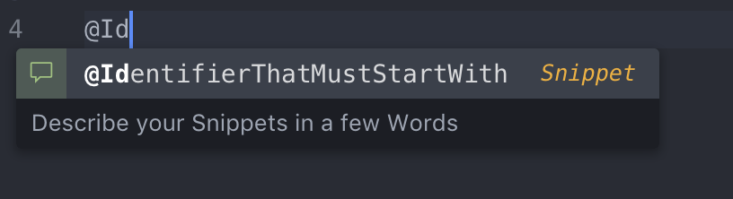

# Custom-Snippets for Atom

This package helps to use custom Snippets in an ```XML``` or ```HTML```  file.

Opposed to the local Snippets feature of Atom with this package you can link to a ```.json``` File on the Internet.

## Json File Structure
```
[
    {
        "description": "Describe your Snippets in a few Words",
        "displayText": "@IdentifierThatMustStartWith@",
        "snippet": "Your Snippet Code"
    }
]
```
**Result**


## Configuration


## Install
```apm install custom-snippets``` or search ```custom-snippets``` under packages within Atom.

## License
MIT © Jérôme Hadorn

Thanks to [@lonekorean](https://github.com/lonekorean "lonekorean GitHub Page") for the base repository.
